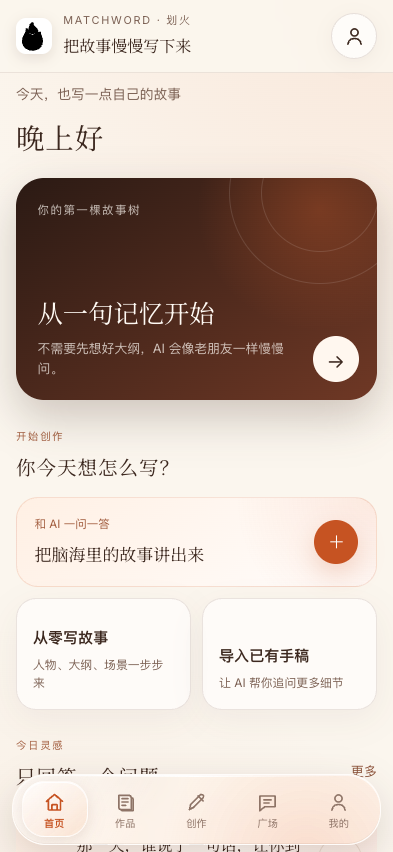
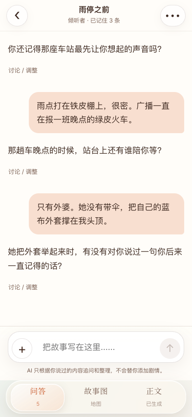
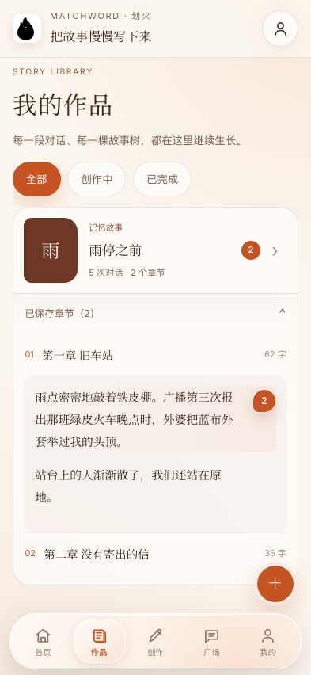
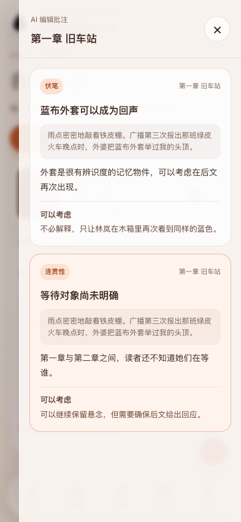

  
  <h1>MatchWord · 划火</h1>
  
<strong>把故事慢慢写下来。</strong>

  
一个以对话为入口、尊重作者主导权的 AI 小说创作 App。

## 产品理念

很多人不是没有故事，而是不知道怎样开始，也不习惯面对空白文档。MatchWord 把 AI 设计成一位耐心的故事倾听者或同行冒险者：它一次只问一个问题，帮助作者把人物、场景、冲突和记忆慢慢说清楚，再把已经确认的内容整理成正文。

AI 可以追问、整理和提出可选建议，但不会擅自替作者决定剧情。

## 核心体验

- **互动问答**：像聊天一样讲故事，AI 沿着作者的思路继续追问。
- **故事图**：人物、事件与线索随着对话逐步生长。
- **章节创作**：每章拥有独立的问答边界，正文只吸收当前章节内容。
- **原声保护**：作者可以讨论或纠正 AI 的提议，未确认内容不会成为故事事实。
- **全书检查**：检查语法语病、前后连贯性、人物一致性、逻辑缺口与伏笔机会。
- **段落批注**：建议以数字气泡标在对应原文旁，点击后从右侧查看详细说明。
- **作品管理**：集中查看所有作品及其已保存章节。
- **分享与导出**：生成带品牌信息的长图，或导出纯文字文件。

## 界面预览

> 预览内容均为虚构演示文本，不包含真实用户作品。

  
  
  
  

## 设计语言

暖白、深棕与深橙构成安静的纸张与火光感。底部导航采用轻量 Liquid Glass 表现，玻璃层只服务于导航与控制，正文仍保持清晰、舒适的纸面阅读体验。

## 当前状态

- iOS 内测版本：Build 9
- 桌面端、Android：持续设计与验证中
- 产品阶段：私密内测

## 隐私与知识产权

这个公开仓库仅用于作品集展示，不包含产品源代码、模型提示词、API Key、测试账号、签名资料或用户数据。所有界面、品牌与产品设计版权归项目作者所有。

---

  <strong>MatchWord · 划火</strong> 
  From a spark of memory to a story of your own.

